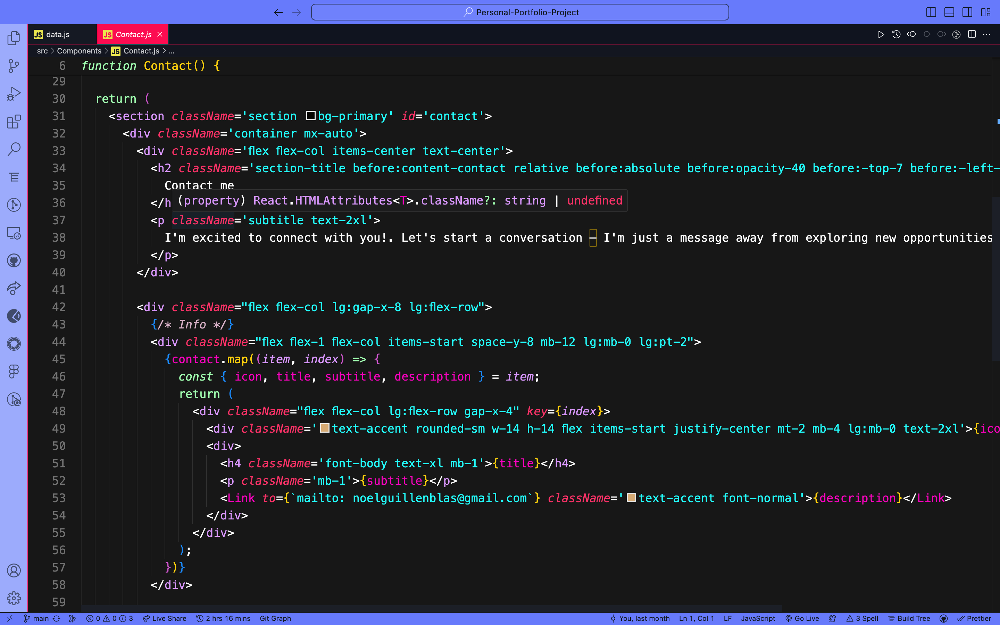
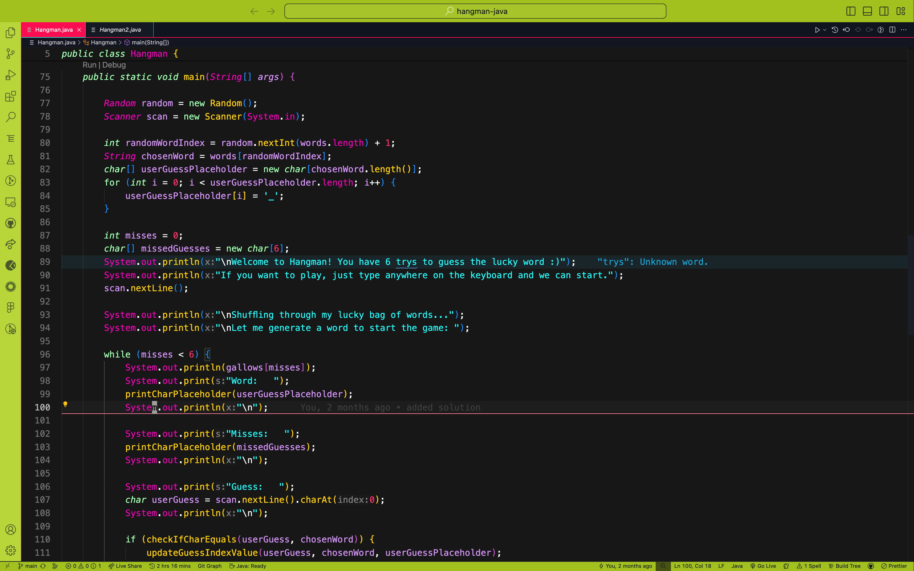
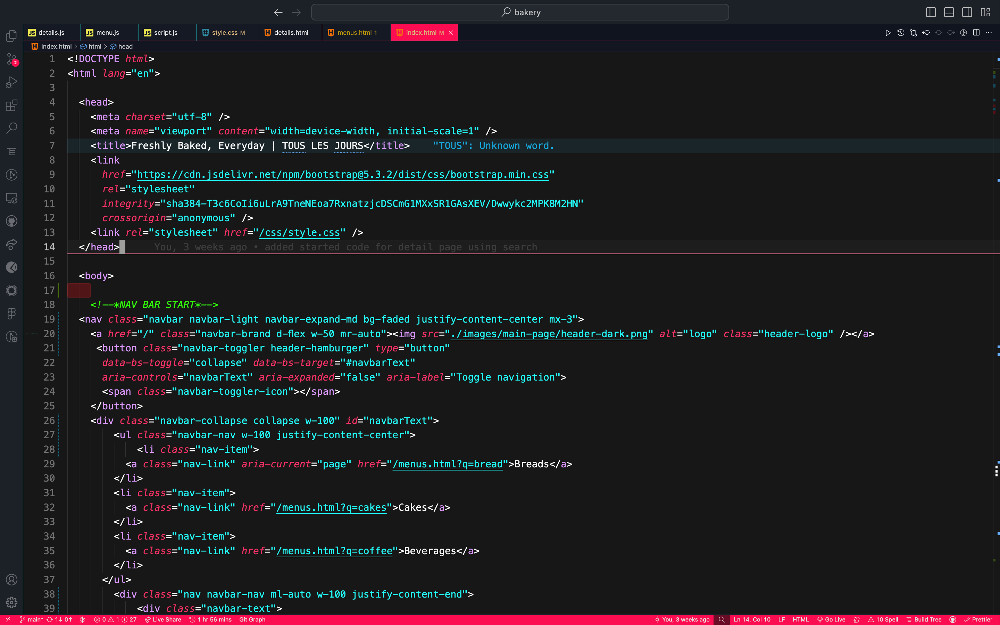
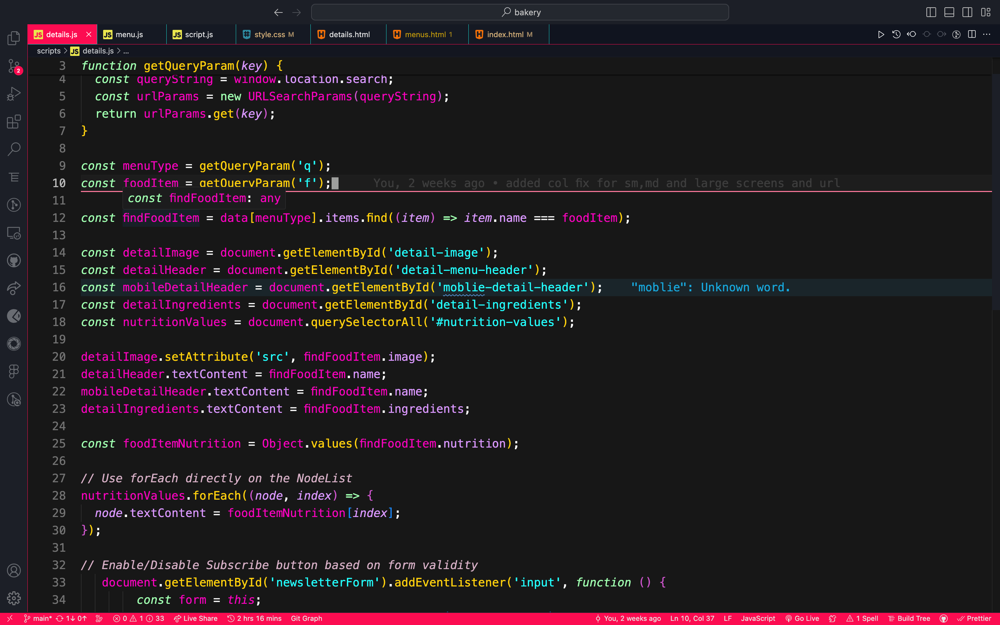
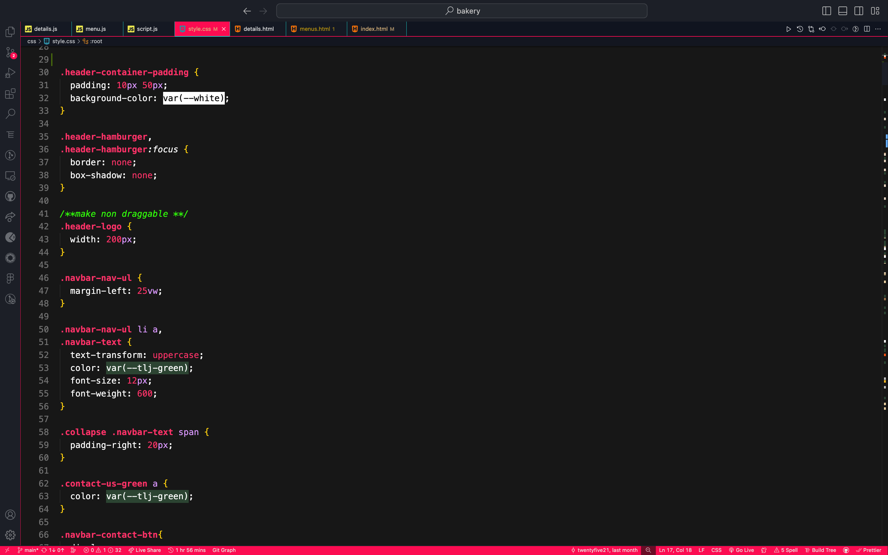
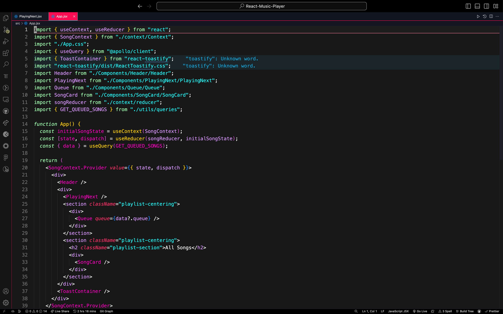
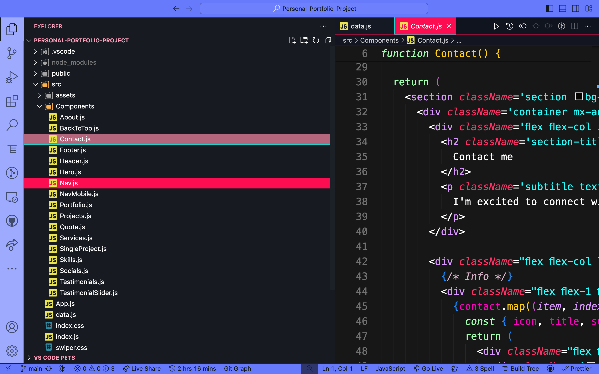

# Piglets Touch Theme

The Piglets Touch Theme is a vibrant and colorful theme designed to enhance your coding experience in Visual Studio Code.

Picture this: a world where your code isn't just lines and characters, but a canvas of vibrant colors inspired by the playful nature of piglets. With the Piglets Touch Theme, your coding environment transforms into a whimsical playground where creativity knows no bounds. This theme aims to provide a visually appealing and comfortable environment for coding.

## A Splash of Color, A Touch of Joy

Say goodbye to dull and monotonous coding sessions. Dive into a world of lively hues and cheerful contrasts that make every line of code a delightful sight. Whether you're debugging, refactoring, or crafting new features, let the Piglets Touch Theme infuse your work with an extra dose of joy.
<!-- 
## Comfort and Style Combined

Coding isn't just about functionality; it's about the experience. That's why the Piglets Touch Theme doesn't just prioritize aesthetics; it ensures your comfort too. Carefully chosen colors and gentle contrasts make long coding sessions a breeze, ensuring your eyes stay fresh and focused. -->

#### Piglets Touch Theme Preview React Components

#### Piglets Touch Theme Preview Java File

#### Piglets Touch Theme Preview HTML File

#### Piglets Touch Theme Preview JavaScript File

#### Piglets Touch Theme Preview CSS File

#### Piglets Touch Theme Preview React App.jsx File

#### Piglets Touch Theme Preview VSCODE SIDEBAR

## Features

- **Vibrant Colors**: Enjoy a colorful palette that makes different elements of your codebase stand out.
- **Playful Design**: Inspired by the lively nature of piglets, this theme brings a touch of fun to your coding environment.
- **Custom Syntax Highlighting**: Tailored syntax highlighting for various programming languages to improve code readability.
- **Easy on the Eyes**: Carefully chosen colors and contrasts ensure comfortable coding sessions for extended periods.

## Installation

1. Install the theme.
2. Select 'Set Color Theme'.
3. Choose 'Piglets Touch Theme' from the list.
4. Click on Reload to apply the theme changes in Visual Studio Code.

## Feedback

If you encounter any issues with the theme or have suggestions for improvements, please don't hesitate to [open an issue](https://github.com/1uckyswish/piglets-touch) on the GitHub repository or make a pull request.

## Creator

The Piglets Touch Theme was created by [Noel Guillen](https://www.linkedin.com/in/noel-guillen-blas-b63353257/). You can find more about the creator on their [GitHub profile](https://github.com/1uckyswish).
